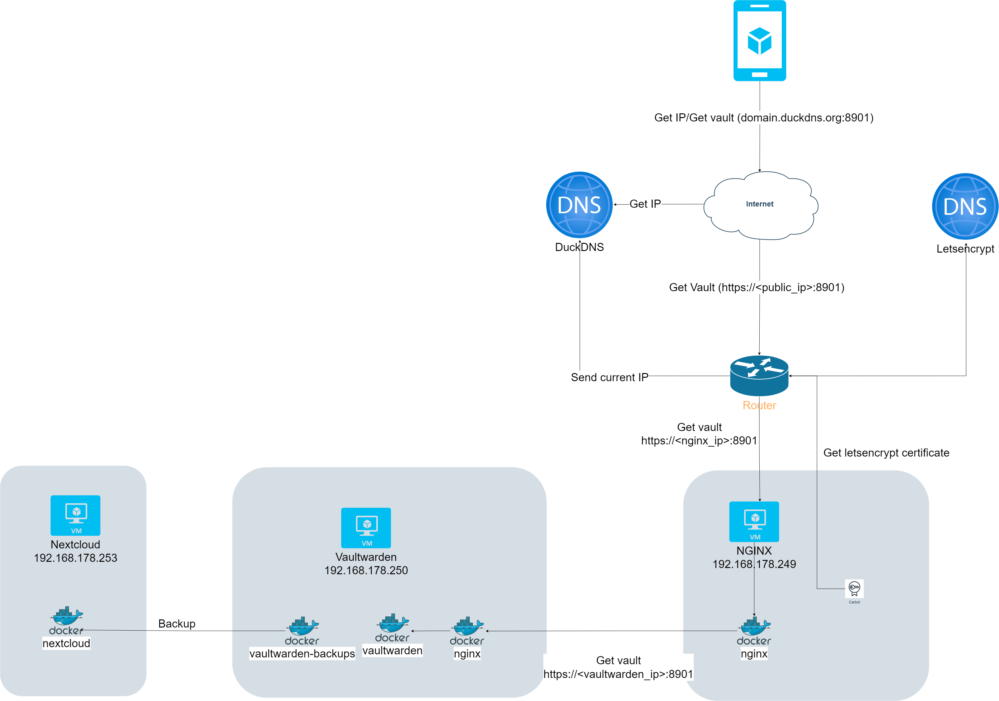

# Self hosted Vaultwarden setup




- [Self hosted Vaultwarden setup](#self-hosted-vaultwarden-setup)
  * [Prerequisites](#prerequisites)
  * [Bitwarden VM](#bitwarden-vm)
    + [Install Vaultwarden](#install-vaultwarden)
    + [Configure Vaultwarden](#configure-vaultwarden)
    + [Configure local NGINX](#configure-local-nginx)
  * [Configure backup](#configure-backup)
    + [Firewall Vaultwarden](#firewall-vaultwarden)
  * [Nginx VM](#nginx-vm)
    + [Install NGINX](#install-nginx)
    + [Create a Letsencrypt certificate](#create-a-letsencrypt-certificate)
    + [Configure NGINX](#configure-nginx)
    + [Firewall NGINX](#firewall-nginx)
- [Nextcloud VM](#nextcloud-vm)


This project contains a tutorial to make vaultwarden work from a home network allowing it to be used from everywhere. The passwords are backed up into nextcloud.


## Prerequisites

1. A DDNS (dynamic dns) service that is allowed to provide your public IP address. For example [duckdns](duckdns.org).
1. A router that allows you to expose some ports and forward them to a virtual machine.
1. A couple of servers or virtual machines.

## Bitwarden VM

This VM contains the Vaulwarden application together with an NGINX that is served with a self signed certificate and a backup container.

### Install Vaultwarden

1. Create a Debian virtual machine.
1. Install docker see [the documentation](https://docs.docker.com/engine/install/debian/).
1. Copy the files inside `01_vaultwarden` into a folder. for example `/usr/local/vaultwarden`.

### Configure Vaultwarden

1. In the docker-compose.yaml make sure you are exposing the desired port, to make it harder to be found use a port different that `443`. In this example `8901` will be used.
1. Make a copy of the `.example.env` file as `.env` and configure the parameters there. Some notes:
    1. `ADMIN_TOKEN`: This password will be needed to access the admin UI `https://<ip>/admin`.

        ```bash
        apt-get install argon2
        echo -n "<MY_SECURE_PASSWORD" | argon2 "$(openssl rand -base64 32)" -e -id -k 65540 -t 3 -p 4 | sed 's#\$#\$\$#g'
        ```

    1. `SMTP_PASSWORD`: Generate a password for this application in [google](https://myaccount.google.com/apppasswords).
    1. `BACKUP_PASSWORD`: Strong password that will be needed to decrypt the backups.

### Configure local NGINX

1. Create self signed certificate that will allow to test the configuration in the local network ([thanks to](https://stackoverflow.com/questions/58500892/install-self-signed-certificates-no-longer-working-in-android-q)):

    ```bash
    cd /usr/local/vaultwarden/nginx/ssl
    openssl req -new -newkey rsa:2048 -days 3650 -nodes -x509 -subj "/C=<YOUR_COUNTRY>/ST=<YOUR_LOCATION>/L=<YOUR_COMPANY>/O=<YOUR_COMPANY>/OU=Engineering/CN=192.168.178.250" -keyout ca.key -out ca.crt
    openssl genrsa -out "ssl.key" 2048
    openssl req -new -key ssl.key -out ssl.csr -config openssl.conf
    openssl x509 -req -days 3650 -in ssl.csr -CA ca.crt -CAkey ca.key -CAcreateserial -extensions v3_req -extfile openssl.conf -out ssl.crt
    openssl x509 -inform PEM -outform DER -in ssl.crt -out ssl.der.crt  

    ```

    1. Make sure to use the `openssl.conf`.
    1. Make sure to use the correct ip.
    1. Download the PEM certificate displayed from the browser.
    1. Installed as CA (no app or vpn) in the phone.
1. Configure the correct IP for your network in `nginx/nginx.conf`.

## Configure backup

1. If you don't want to use `nextcloud`  create a configuration using the wizard of executing:

    ```bash
    docker run --rm -it \
    -v ./backup-config:/config/ \
    ttionya/vaultwarden-backup:latest \
    rclone config
    ```

1. Upload to nextcloud.
    1. Generate an application password from `nextcloud`  admin UI.
    1. Encrypt it with:

        ```bash
        docker run --rm -it \
        ttionya/vaultwarden-backup:latest \
        rclone obscure <YOUR_APPLICATION_PASSWORD>
        ```

    1. Add it to the `rclone.conf`.

### Firewall Vaultwarden

Generate a basic firewall for the VM

1. Install:

    ```bash
    sudo apt-get update
    sudo apt-get install iptables-persistent
    ```

1. Execute rules:

    ```bash
    # Allow established connections
    iptables -A INPUT -m conntrack --ctstate ESTABLISHED,RELATED -j ACCEPT
    # Uncomment to allow ICMP 
    # iptables -A INPUT -p icmp --icmp-type 8 -j ACCEPT # Allow ICMP
    # Allow SSH only from localnetwork
    iptables -A INPUT -p tcp -s 192.168.178.0/24,192.168.179.0/24 --dport 22 -j ACCEPT
    # HTTP redirection and Letsencrypt challenge
    iptables -A INPUT -p tcp --dport 80 -j ACCEPT # Allow HTTP
    # Application
    iptables -A INPUT -p tcp --dport 443 -j ACCEPT # Allow HTTPS
    # Drop everything else
    iptables -A INPUT -j DROP
    ```

1. Save the rules

    ```bash
    iptables-save > /etc/iptables/rules.v4
    ```

1. Start the docker compose with `docker compose up -d`.

## Nginx VM

This VM has the only function of acting as reverse proxy but also being an added layer between what is exposed to the internet and the data that we want to keep safe. Therefore if an attacker gains access to the VM exposed he/she should not be able to get our data so easily.

### Install NGINX

1. Create a Debian virtual machine.
1. Install docker see [the documentation](https://docs.docker.com/engine/install/debian/).
1. Copy the files inside `02_nginx` into a folder. for example `/usr/local/nginx`.

### Create a Letsencrypt certificate

1. Install `certbot` with:

    ```bash
    apt -y install certbot python3-certbot-apache
    ```

1. Run the wizard with:

    ```bash
    certbot certonly --standalone -d <YOUR_DOMAIN>.duckdns.org
    ```

1. At the end a path to your certificates should be provided.
1. Create a cronjob to renew the certificate:

    ```bash
    0 12 * * * /usr/bin/certbot renew --quiet
    ```

### Configure NGINX

1. Make sure you have your IPs, DNS and certificates in `nginx/nginx.conf` according to your project.

### Firewall NGINX

Generate a basic firewall for the VM.

1. Install:

    ```bash
    sudo apt-get update
    sudo apt-get install iptables-persistent
    ```

1. Execute rules:

    ```bash
    # Allow established connections
    iptables -A INPUT -m conntrack --ctstate ESTABLISHED,RELATED -j ACCEPT
    # Make it harder to reach by to allowing ICMP 
    # iptables -A INPUT -p icmp --icmp-type 8 -j ACCEPT # Allow ICMP
    # Allow SSH only from local network
    iptables -A INPUT -p tcp -s 192.168.178.0/24,192.168.179.0/24 --dport 22 -j ACCEPT
    # Letsencrypt challenge
    iptables -A INPUT -p tcp --dport 80 -j ACCEPT # Allow HTTP
    # HTTPS port is exposed by docker automatically in a different port
    # iptables -A INPUT -p tcp --dport 443 -j ACCEPT # Allow HTTPS
    # Drop everything else
    iptables -A INPUT -j DROP
    ```

# Nextcloud VM

The configuration of nextcloud is out of the scope of this project.
